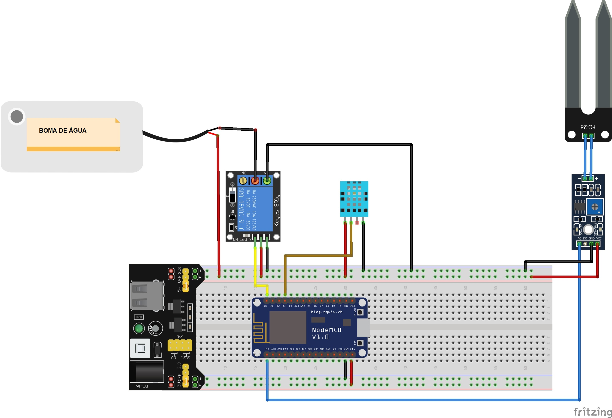

# Sistema de irrigação automatizada para hortas caseiras

Manuel Martínez TIA: 19004869 TURMA 05A

## 1. Descrição do Projeto

Este projeto apresenta um método de irrigação automatizada de fácil aplicação para uma horta caseira, utilizando um sensor higrômetro que verifica as condições de solo através do módulo NodeMCU ESP-12E.  Definindo- se que para quando a umidade do solo atingir menos de 45% se ativará uma bomba de água que funcionará até a humidade chegar a 50%. Sendo esses dados enviados para um servidor na plataforma Adafruit IO pelo protocolo MQTT, em conjunto com os dados de temperatura e humidade do ambiente que serão medidos por um sensor DHT11.

**Documentação das bibliotecas utilizadas:**
- [ESP8266WiFi](https://arduino-esp8266.readthedocs.io/en/latest/esp8266wifi/readme.html)
- [DHT-sensor-library](https://github.com/adafruit/DHT-sensor-library)
- [Adafruit_MQTT_Library](https://github.com/adafruit/Adafruit_MQTT_Library)

**IDE utilizado para a programação:**
- [Arduino IDE](https://www.arduino.cc/en/software)

## 2. Esquema de Conexão

**Componentes utilizados:**
- Módulo WiFi ESP8266 NodeMCU ESP-12E
- Sensor DHT11
- Sensor higrômetro
- Módulo Relé 5V com 1 canal (com transistor J3Y)
- Protoboard MB102
- Mini Bomba de Água Submersível (2.5-6V)
- Fonte Ajustável MB102
- Cabos Jumper Macho-Fêmea
- Cabos Jumper Macho-Macho

## 3. Passos para a implementação
1. Crie sua conta na plataforma [Adafruit IO](https://io.adafruit.com/)
2. Crie os feeds definidos no [Código](./src/horta_iot.ino) na plataforma Adafruit IO
3. Crie o [Dashboard](./doc/dashboard_adafruit.jpg) para a leitura dos dados dos feeds
4. Implemente o esquema de conexões com os componentes do projeto
5. Instale as bibliotecas requeridas no IDE Arduino
6. Substitua no código os dados da rede WiFI e as credenciais da plataforma Adafruit IO
7. Faça carga do código no NodeMCU ESP-12E usando o cabo USB, com a fonte ajustável em off e 5V
8. Revise o envio de dados no monitor serial do IDE Arduino
9. Troque a alimentação do cabo USB pela fonte de alimentação
